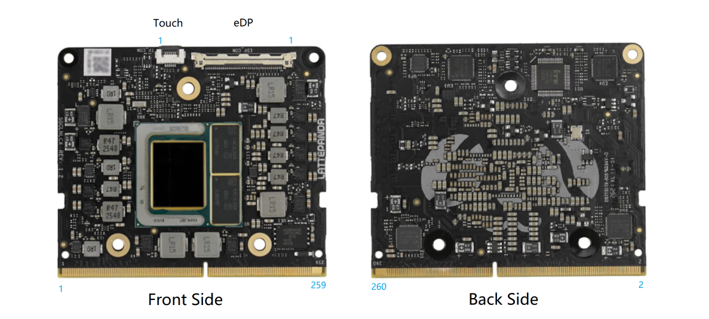

# Pinouts

All pin definitions for LattePanda Mu Ultra(226V/256V Processor).

## Edge Connector

The edge connector of LattePanda Mu Ultra is designed for DDR4 260P SODIMM. But this pin table is too long, so we put it in a separate .xlsx file.

- [LattePanda Mu Ultra Edge Connector Pinout](./LattePanda_Mu_Ultra_Edge_Connector_Pinout.xlsx)

⚠️ Note:  
Due to the various PCIe bifurcation, you should check the [BIOS functionality documentation](../../Softwares/BIOS/) before starting your design. Do not design directly from the pin definition documentation here.

## Edge Connector Comparison

LattePanda Mu and LattePanda Mu Ultra use the same edge connector, but their pin definitions are slightly different.

To facilitate your comparison and evaluation, we have provided a pin comparison document for both models.

- [LattePanda_Mu_and_Mu_Ultra_Pinout_Comparison](./LattePanda_Mu_and_Mu_Ultra_Pinout_Comparison.xlsx)

## eDP

I-PEX 20455-040E

| Number | Name      | Type | Description              |
| ------ | --------- | :--: | ------------------------ |
| 1      | NC        |      |                          |
| 2      | GND       |      |                          |
| 3      | DDIA_TX3- |  O   | Lane 3 (-)               |
| 4      | DDIA_TX3+ |  O   | Lane 3 (+)               |
| 5      | GND       |      |                          |
| 6      | DDIA_TX2- |  O   | Lane 2 (-)               |
| 7      | DDIA_TX2+ |  O   | Lane 2 (+)               |
| 8      | GND       |      |                          |
| 9      | DDIA_TX1- |  O   | Lane 1 (-)               |
| 10     | DDIA_TX1+ |  O   | Lane 1 (+)               |
| 11     | GND       |      |                          |
| 12     | DDIA_TX0- |  O   | Lane 0 (-)               |
| 13     | DDIA_TX0+ |  O   | Lane 0 (+)               |
| 14     | GND       |      |                          |
| 15     | DDIA_AUX+ |  O   | Auxiliary channel (+)    |
| 16     | DDIA_AUX- |  O   | Auxiliary channel (-)    |
| 17     | GND       |      |                          |
| 18     | LCD_VCC   |      | LCD Power Supplies       |
| 19     | LCD_VCC   |      | LCD Power Supplies       |
| 20     | LCD_VCC   |      | LCD Power Supplies       |
| 21     | LCD_VCC   |      | LCD Power Supplies       |
| 22     | Selftest  |  O   | Default Grounding        |
| 23     | GND       |      |                          |
| 24     | GND       |      |                          |
| 25     | GND       |      |                          |
| 26     | GND       |      |                          |
| 27     | HPD       |  I   | Plug Detection           |
| 28     | GND       |      |                          |
| 29     | GND       |      |                          |
| 30     | GND       |      |                          |
| 31     | GND       |      |                          |
| 32     | BL_EN     |  O   | Backlight enable         |
| 33     | BL_PWM    |  O   | Backlight PWM dimming    |
| 34     | NC        |      |                          |
| 35     | NC        |      |                          |
| 36     | BL_PWR    |      | Backlight Power Supplies |
| 37     | BL_PWR    |      | Backlight Power Supplies |
| 38     | BL_PWR    |      | Backlight Power Supplies |
| 39     | BL_PWR    |      | Backlight Power Supplies |
| 40     | NC        |      |                          |

- **LCD_VCC**: +3.3V
- **BL_PWR**: Same as LattePanda Mu Ultra's power input voltage
- **Selftest**: Factory test pin, ground by default

## Touch

Clamshell 6P 0.5mm FFC/FPC Connector

| Number | Name       | Type | Description           |
| ------ | ---------- | :--: | --------------------- |
| 1      | I2C0_SCL   |  O   | I2C Bus               |
| 2      | I2C0_SDA   | I/O  | I2C Bus               |
| 3      | GND        |      |                       |
| 4      | TOUCH_RST# |  O   | Touch panel reset     |
| 5      | TOUCH_INT  |  I   | Touch event interrupt |
| 6      | +3.3V      |      | Touch panel power     |
