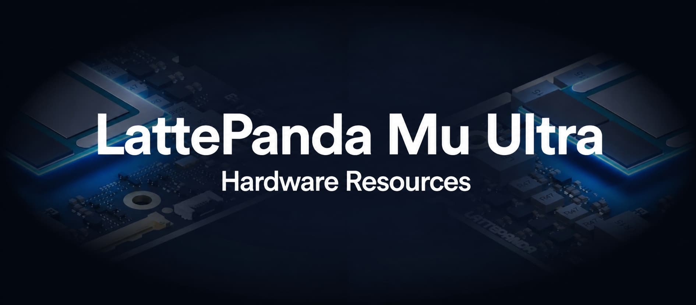

Welcome to the hardware design repository for the [LattePanda Mu Ultra x86 Compute Module for On-device AI](https://www.lattepanda.com/lattepanda-mu-ultra). Leveraging its rich array of high-speed I/O interfaces and powerful AI compute, you can craft your own custom carrier boards and deploy personalized AI-powered devices. While we provide reference designs to kick-start your development, endless possibilities await your exploration. This repository is continuously updated to empower your hardware innovations.

## Documentation

- [**LattePanda Mu Ultra Compute Module User Guide**](https://docs.lattepanda.com/content/mu_ultra_edition/introduction/)

- Carrier Board Hardware Design Guide(Coming soon)

- [**Carrier Board Compatibility & User Guide**](https://docs.lattepanda.com/content/mu_edition/module_carrier_compatibility/)

- [**LattePanda Website**](https://www.lattepanda.com/)

- [**Join our Discord**](https://discord.gg/RkSvc9g7eU)

## Resource Directory

- **Electricals**: This includes pin descriptions, symbols and footprint libraries, official carrier board projects.

- **Mechanicals**: This section provides 2D dimensional drawings and 3D models of the LattePanda Mu Ultra.

- **Software**: BIOS firmware, drivers, and other related software resources.
